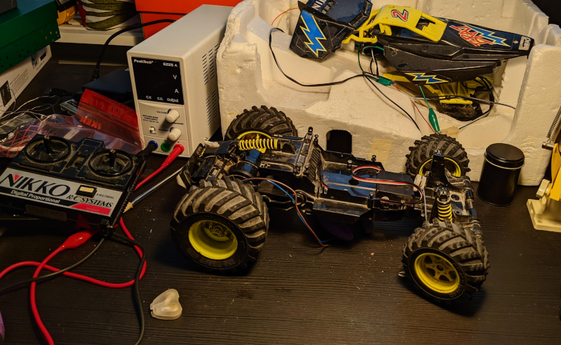

# Brat rc car conversion project

## configuration before running

_Not required anymore:_ Copy the file `wifi_template.ini` to `wifi.ini` and change password
and ssid to match your network.

## Example of non async udp receive
https://siytek.com/esp8266-udp-send-receive/